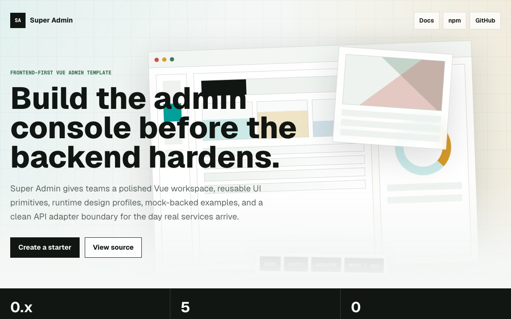

# Super Admin

Frontend-first Vue admin template with reusable UI primitives, runtime design profiles, example modules, and replaceable API adapters.

[](https://www.npmjs.com/package/create-super-admin)
[](https://www.npmjs.com/package/@super-admin-org/core)
[](LICENSE)
[](https://lineo7387.github.io/super-admin/)

Super Admin is designed for teams who want a flexible admin-console foundation without being forced into a backend, database, auth provider, AI provider, or generated API schema on day one.

## Status

This project is under active `0.x` development after its initial npm release. The current public package line is `0.1.x`.

Current focus:

- Vue admin app with example modules.
- Shared `core`, `ui`, and `theme` packages.
- Optional Hono reference backend for maintainer validation.
- Documentation for adapter replacement and template boundaries.
- Internationalization foundation with `zh-CN` as the default locale.
- Published `create-super-admin` CLI generation and release validation.

## Use The Starter

Create a starter from npm:

```bash
npm create super-admin@latest my-admin
cd my-admin
npm install
npm run dev
```

Prefer pnpm:

```bash
pnpm dlx create-super-admin@latest my-admin --pm pnpm
cd my-admin
pnpm install
pnpm dev
```

This generated project is where you build your own admin app. It stays frontend-first and does not include this repository's release automation, docs site, optional reference backend validation, or maintainer AI workflow files.

## Develop This Repository

Use this path when you want to work on Super Admin itself: the source template, packages, docs, CLI, release scripts, or public repository presentation.

Install dependencies:

```bash
pnpm install
```

Run the admin app:

```bash
pnpm dev
```

Run the documentation site:

```bash
pnpm docs:dev
```

Run workspace checks:

```bash
pnpm lint
pnpm typecheck
pnpm test
pnpm build
```

## Preview And Docs



User docs:

- [Hosted docs/demo 中文](https://lineo7387.github.io/super-admin/)
- [Hosted docs/demo English](https://lineo7387.github.io/super-admin/en/)
- [Getting started](docs/guide/getting-started.md)
- [Examples guide](docs/guide/examples.md)
- [API adapters](docs/guide/api-adapters.md)
- [Themes and layouts](docs/guide/themes-layouts.md)

Maintainer docs:

- [Open source workflow](docs/guide/open-source-workflow.md)
- [AI collaboration](docs/guide/ai-collaboration.md)
- [Releasing](docs/guide/releasing.md)
- [Public presentation checklist](docs/guide/public-presentation.md)

The hosted docs/demo is deployed from `docs/` through GitHub Pages. Use `pnpm dev` locally for the full interactive admin preview.

## Feature Preview Assets

Current public preview asset:

- `docs/public/super-admin-preview.jpeg` — docs homepage preview for the public product story and admin visual direction.

Recommended next preview assets:

- Admin shell with workspace tabs, command/search entry, and example modules.
- Runtime theme/profile switching across Base, Crypto, Cyberpunk, Industrial, and Newsprint.
- API adapter replacement flow: page -> query composable -> API adapter -> mock/user API.
- A short GIF of `npm create super-admin@latest my-admin` followed by `npm run dev`.

Store final assets under `docs/public/` or another stable docs asset path before embedding them in this README.

## Source Repository Shape

```text
apps/admin/          Vue admin template app
apps/api/            Optional Hono reference API for maintainer validation
packages/core/       Shared frontend contracts and helpers
packages/ui/         Reusable admin UI primitives
packages/theme/      Design profiles and token helpers
packages/theme-*/    Independently installable design profile packages
packages/cli/        Optional create-super-admin scaffolder
docs/                VitePress documentation
scripts/             Maintainer validation scripts
```

A project generated with `create-super-admin` is intentionally smaller: it is your runnable admin app, not this full source repository.

## Core Boundary

The default template is frontend-first and mock-backed. It should run without:

- backend server
- database or ORM
- auth provider
- AI provider
- fixed API response shape
- CLI-only hidden service

When a screen already fits your business workflow, replace the API adapter. When the workflow differs, reshape the page, components, types, queries, and adapter together.

## Documentation

User-facing docs:

- [Getting started](docs/guide/getting-started.md)
- [Project structure](docs/guide/project-structure.md)
- [API adapters](docs/guide/api-adapters.md)
- [Themes and layouts](docs/guide/themes-layouts.md)
- [Examples](docs/guide/examples.md)
- [Optional backend](docs/guide/optional-backend.md)

Maintainer docs:

- [Open source workflow](docs/guide/open-source-workflow.md)
- [AI collaboration](docs/guide/ai-collaboration.md)
- [Releasing](docs/guide/releasing.md)
- [Public presentation](docs/guide/public-presentation.md)

## Maintainer Workflow Files

This repository includes `.trellis/`, `.agents/`, `.agent/`, `.claude/`, `.codex/`, `.mcp.json`, and related AI workflow files for maintainers. They are not part of the generated starter contract and are not required to use `npm create super-admin`.

## Maintainer Validation

The optional reference backend validates that the admin app can connect to a real API without making the backend mandatory for users.

```bash
pnpm validate:starter
pnpm test:reference
```

These smoke tests are maintainer-only and intentionally stay out of the default user path.

## Contributing

Read [CONTRIBUTING.md](CONTRIBUTING.md) before opening a pull request.

## License

MIT. See [LICENSE](LICENSE).
